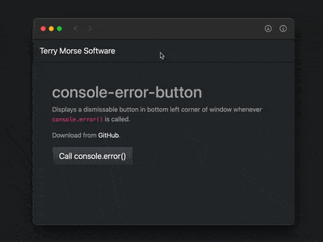

# console-error-button

Display a button on web page whenever `console.error()` is called.

## Why?

Because during development, it's nice to get notification whenever an error occurs, so you immediately can pop open the web inspector to see what the trouble is.



## Usage

```HTML
<script
  src="https://cdn.jsdelivr.net/npm/console-error-button/consoleErrBtn.js"
></script>
```
